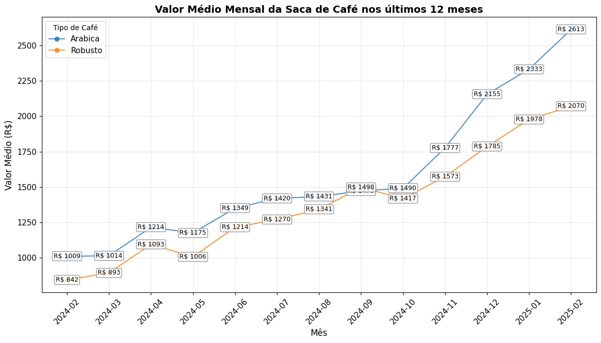

# Análise dos preços do café 2024-2025

O objetivo desse projeto é analisar as motivações para as altas consecutivas do preço do café e outras commodities no mercado brasileiro.

Este gráfico abaixo demonstra a média mensal dos valores em reais dos preços da saca de Café arábico e robusto (60KG) no Brasil no período dos últimos 12 meses.
